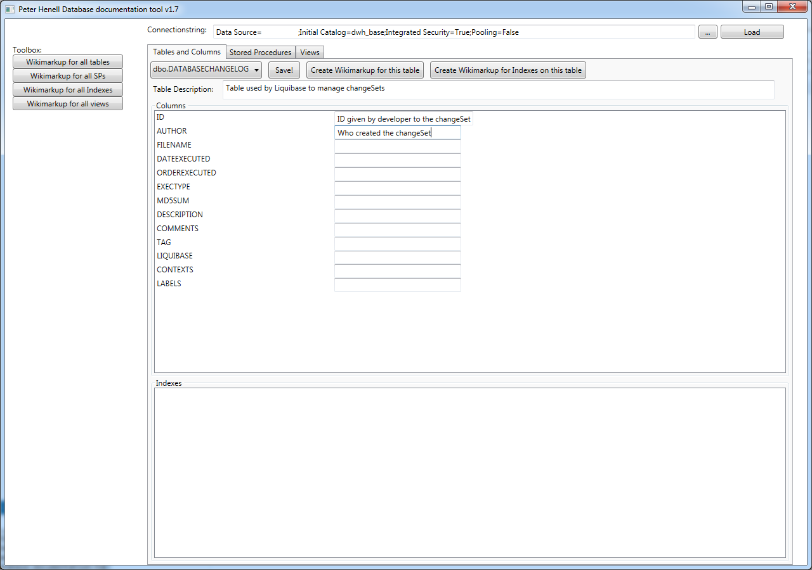

# database-documentation-tool
GUI for managing documentation of tables, columns, views, stored procedures, functions and indexes by manipulating extended properteis of the objects.

When documentation have been added for each object (or some of them) you can create a wiki markup version for an entire database.
This generated documentation can then be pasted directly into confluence (or other wiki system).

Download the latest version here https://github.com/PeterHenell/database-documentation-tool/tree/master/released-binaries

# New in release 1.8
It is now possible to generate SQL Statements which will add or update the extended properties. 
```SQL
  EXEC sys.sp_addextendedproperty 
      @value = 'The username of the owner of the account', 
      @name = 'MS_Description', 
      @level0type = 'SCHEMA', 
      @level0name = 'Accounting', 
      @level1type = 'Table', 
      @level1name = 'account', 
      @level2type = 'Column', 
      @level2name = 'UserName';
``` 

Screen:

